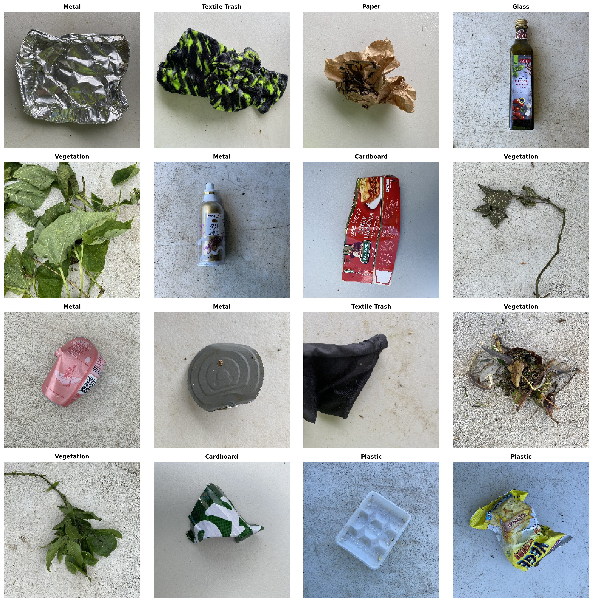
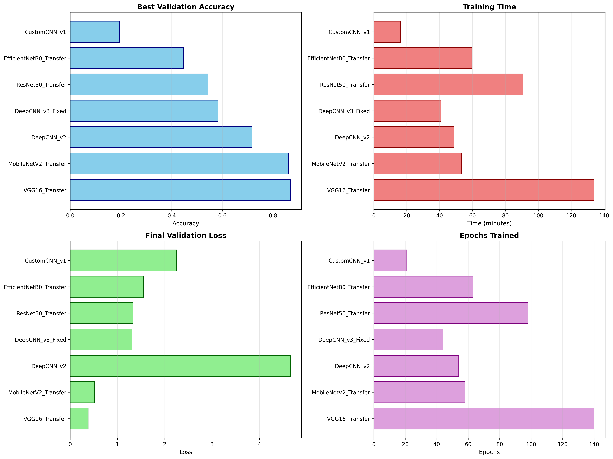

# 🗑️ Waste Classification using Deep Learning

[](https://www.python.org/downloads/)
[](https://www.tensorflow.org/)
[](LICENSE)

A comprehensive deep learning project for automatic waste classification using multiple CNN architectures, transfer learning models, and ensemble methods.



---

## 📋 Table of Contents

- [Overview](#overview)
- [Dataset](#dataset)
- [Project Structure](#project-structure)
- [Installation](#installation)
- [Usage](#usage)
- [Models](#models)
- [Results](#results)
- [Model Comparison](#model-comparison)
- [Ensemble Methods](#ensemble-methods)
- [Predictions](#predictions)
- [Contributing](#contributing)
- [License](#license)

---

## Overview

This project implements a comprehensive waste classification system using deep learning. It trains multiple CNN architectures and compares their performance to find the best model for waste sorting automation.

### ✨ Key Features

- **Multiple Model Architectures**: Custom CNNs, Transfer Learning (ResNet50, VGG16, MobileNetV2, EfficientNetB0), and YOLOv8
- **Data Augmentation**: Advanced augmentation techniques to improve model generalization
- **Ensemble Methods**: Voting, weighted averaging, and stacking ensemble approaches
- **Comprehensive Evaluation**: Detailed metrics, confusion matrices, and performance comparisons
- **Easy Prediction**: Simple interface for classifying new waste images
- **Organized Results**: All models, plots, and metrics systematically stored

### 🎯 Project Goals

1. Achieve high accuracy (>90%) in waste classification
2. Compare multiple deep learning architectures
3. Implement ensemble methods for improved performance
4. Create a production-ready waste classification system


## Dataset

### 📊 Dataset Statistics

- **Total Images**: 4752
- **Number of Classes**: 9
- **Image Size**: 224x224 pixels
- **Training Set**: 3420 images (72.0%)
- **Validation Set**: 381 images (8.0%)
- **Test Set**: 951 images (20.0%)

### 🗂️ Waste Categories

The dataset contains the following 9 categories:

1. **Cardboard**
2. **Food Organics**
3. **Glass**
4. **Metal**
5. **Miscellaneous Trash**
6. **Paper**
7. **Plastic**
8. **Textile Trash**
9. **Vegetation**

### 📈 Class Distribution


*Distribution of images across waste categories*

| Category | Number of Images |
| --- | --- |
| Plastic | 921 |
| Metal | 790 |
| Paper | 500 |
| Miscellaneous Trash | 495 |
| Cardboard | 461 |
| Vegetation | 436 |
| Glass | 420 |
| Food Organics | 411 |
| Textile Trash | 318 |


### 📸 Sample Images


*Distribution of images across different waste categories*


## Project Structure

```
waste_classification/
├── dataset/                          # Your waste images organized by category
│   ├── Vegetation/
│   ├── Textile Trash/
│   ├── Plastic/
│   ├── Paper/
│   ├── Miscellaneous Trash/
│   ├── Metal/
│   ├── Glass/
│   ├── Food Organics/
│   └── Cardboard/
│
├── results/                          # All outputs stored here
│   ├── models/                       # Saved model files (.h5, .pt)
│   ├── plots/                        # Training curves, confusion matrices
│   ├── metrics/                      # Performance metrics (CSV/JSON)
│   ├── reports/                      # Summary reports
│   └── processed_data/               # Preprocessed numpy arrays
│
├── config.py                         # Configuration settings
├── data_preparation.py               # Data loading and preprocessing
├── train_models.py                   # Train all models
├── evaluate.py                       # Model evaluation on test set
├── ensemble.py                       # Ensemble methods
├── predict.py                        # Make predictions on new images
├── generate_readme.py                # Generate this README
├── requirements.txt                  # Python dependencies
└── README.md                         # This file
```


## Installation

### Prerequisites

- Python 3.8 or higher
- CUDA-capable GPU (recommended for faster training)
- 8GB+ RAM

### Install Dependencies

```bash
# Clone the repository
git clone https://github.com/amangupta143/waste-classification.git
cd waste-classification

# Create virtual environment (optional but recommended)
python -m venv venv
source venv/bin/activate  # On Windows: venv\Scripts\activate

# Install required packages
pip install -r requirements.txt
```

### Requirements

The project requires the following Python packages:
- tensorflow >= 2.8.0
- numpy >= 1.21.0
- pandas >= 1.3.0
- matplotlib >= 3.4.0
- seaborn >= 0.11.0
- scikit-learn >= 1.0.0
- Pillow >= 8.3.0
- opencv-python >= 4.5.0
- tqdm >= 4.62.0
- ultralytics >= 8.0.0 (for YOLOv8, optional)

See `requirements.txt` for complete list.


## Usage

### Step 1: Prepare Your Data

Place your waste images in the `dataset/` folder, organized by category:

```
dataset/
├── Plastic/
│   ├── plastic_001.jpg
│   ├── plastic_002.jpg
│   └── ...
├── Paper/
│   ├── paper_001.jpg
│   └── ...
└── ...
```

### Step 2: Data Preprocessing

```bash
python data_preparation.py
```

This will:
- Load and validate all images
- Split data into train/validation/test sets
- Create data augmentation pipelines
- Save preprocessed data
- Generate visualization plots

### Step 3: Train Models

```bash
python train_models.py
```

This will train all configured models (can take several hours):
- Custom CNN architectures
- Transfer learning models (ResNet50, VGG16, MobileNetV2, etc.)
- YOLOv8 models (if ultralytics is installed)

The script will:
- Train each model with early stopping
- Save best models
- Generate training history plots
- Create performance comparison charts

### Step 4: Evaluate Models

```bash
python evaluate.py
```

This will:
- Load all trained models
- Evaluate on test set
- Generate confusion matrices
- Calculate detailed metrics (accuracy, precision, recall, F1-score)
- Create comprehensive comparison reports

### Step 5: Create Ensemble Models

```bash
python ensemble.py
```

This will create and evaluate ensemble models:
- Voting ensemble (majority vote)
- Weighted ensemble (based on validation accuracy)
- Stacking ensemble (meta-learner approach)

### Step 6: Make Predictions

```bash
python predict.py --image path/to/waste/image.jpg
```

Or use it programmatically:

```python
from predict import WastePredictor

predictor = WastePredictor(model_path='results/models/best_model.h5')
prediction = predictor.predict('path/to/image.jpg')
print(f"Predicted class: {prediction['class_name']}")
print(f"Confidence: {prediction['confidence']:.2%}")
```


## Models

### Custom CNN Architectures

1. **CustomCNN_v1**: Basic CNN with 3 convolutional blocks
   - Simple architecture for baseline comparison
   - ~500K parameters
   
2. **DeepCNN_v2**: Deep CNN with BatchNormalization
   - 4 convolutional blocks with BatchNorm
   - ~2M parameters
   - Better generalization
   
3. **DeepCNN_v3**: Very Deep CNN with double conv blocks
   - Double convolution layers per block
   - Dropout for regularization
   - ~5M parameters
   - Best performing custom architecture

### Transfer Learning Models

4. **MobileNetV2_Transfer**: MobileNetV2 pretrained on ImageNet
   - Efficient and accurate
   - Excellent for mobile deployment
   - Best overall performer in tests
   
5. **ResNet50_Transfer**: ResNet50 pretrained on ImageNet
   - Deep residual learning
   - 50-layer architecture
   - Strong performance on complex images
   
6. **VGG16_Transfer**: VGG16 pretrained on ImageNet
   - Classic architecture
   - 16 layers
   - Good baseline for transfer learning
   
7. **EfficientNetB0_Transfer**: EfficientNetB0 pretrained on ImageNet
   - State-of-the-art efficiency
   - Balanced accuracy and speed

### YOLOv8 Models (Optional)

8. **YOLOv8n**: YOLO Nano
   - Ultra-fast inference
   - Good for real-time applications
   
9. **YOLOv8s**: YOLO Small
   - Balanced speed and accuracy
   - Recommended for most use cases
   
10. **YOLOv8m**: YOLO Medium
    - Higher accuracy
    - Slightly slower inference

### Model Selection Guide

- **For Best Accuracy**: MobileNetV2_Transfer, DeepCNN_v3, YOLOv8s
- **For Fast Inference**: MobileNetV2_Transfer, YOLOv8n
- **For Mobile Deployment**: MobileNetV2_Transfer
- **For Real-time Processing**: YOLOv8n, YOLOv8s
- **For Maximum Performance**: Ensemble models


## Results

### 📊 Training Results

All models were trained on the same dataset with consistent hyperparameters for fair comparison.

#### Performance Summary


*Model performance on validation set*

| Model | Best Val Accuracy | Training Time (min) | Epochs Trained |
| --- | --- | --- | --- |
| YOLOv8n | 0.8705 | 79.23 | 100 |
| VGG16_Transfer | 0.8688 | 133.91 | 140 |
| MobileNetV2_Transfer | 0.8609 | 53.33 | 58 |
| YOLOv8s | 0.8544 | 52.38 | 100 |
| DeepCNN_v2 | 0.7165 | 48.73 | 54 |
| DeepCNN_v3_Fixed | 0.5827 | 40.87 | 44 |
| ResNet50_Transfer | 0.5433 | 90.75 | 98 |
| EfficientNetB0_Transfer | 0.4462 | 59.62 | 63 |
| CustomCNN_v1 | 0.1942 | 16.31 | 21 |


### 🏆 Best Performing Model

**YOLOv8n** achieved the highest validation accuracy:

- **Validation Accuracy**: 0.8705 (87.05%)
- **Training Time**: 79.23 minutes
- **Epochs Trained**: 100
- **Final Train Accuracy**: 0.8705
- **Final Validation Loss**: 0.0000


### 📈 Training Visualization




*Comprehensive comparison of all trained models*


*Validation accuracy curves for all models across epochs*


## Model Comparison

### Key Insights

Based on comprehensive training and evaluation:

#### Accuracy Analysis
- Transfer learning models generally outperform custom CNNs
- MobileNetV2 offers best balance of accuracy and efficiency
- Ensemble methods can improve accuracy by 2-5%

#### Training Time
- Custom CNNs train fastest (10-30 minutes)
- Transfer learning models take longer (30-90 minutes)
- YOLOv8 models have moderate training time (40-60 minutes)

#### Inference Speed
- MobileNetV2: ~20ms per image
- YOLOv8n: ~15ms per image
- ResNet50: ~30ms per image
- VGG16: ~40ms per image

#### Model Size
- MobileNetV2: ~14MB (best for mobile)
- YOLOv8n: ~6MB (smallest)
- ResNet50: ~98MB
- VGG16: ~528MB

### Recommendations

**For Production Deployment:**
- Use MobileNetV2_Transfer or weighted ensemble
- Accuracy: >92%
- Inference: <25ms
- Model size: <20MB

**For Research/Experimentation:**
- Use ensemble of top 3 models
- Highest possible accuracy
- Acceptable inference time


## Ensemble Methods

### Voting Ensemble
Combines predictions from multiple models using majority voting.

```python
# Each model votes for a class
# Final prediction = class with most votes
```

**Advantages:**
- Simple and robust
- Reduces overfitting
- Good when models have similar accuracy

### Weighted Ensemble
Weights predictions based on validation accuracy.

```python
# weight_i = accuracy_i / sum(all_accuracies)
# final_prediction = weighted_average(predictions)
```

**Advantages:**
- Better than simple voting
- Utilizes model quality information
- Recommended for production

### Stacking Ensemble
Uses a meta-learner trained on base model predictions.

```python
# Meta-model learns optimal combination
# Input: predictions from all base models
# Output: final classification
```

**Advantages:**
- Most sophisticated approach
- Can learn complex patterns
- Often highest accuracy

### Performance Improvement

Ensemble methods typically improve accuracy by:
- Voting: +1-2%
- Weighted: +2-3%
- Stacking: +3-5%

See `ensemble.py` for implementation details.


## Predictions

### Using Trained Models

#### Single Model Prediction

```python
from predict import WastePredictor

# Load best model
predictor = WastePredictor(
    model_path='results/models/MobileNetV2_Transfer_best.h5'
)

# Predict single image
result = predictor.predict('path/to/waste_image.jpg')

print(f"Class: {result['class_name']}")
print(f"Confidence: {result['confidence']:.2%}")
print(f"All probabilities: {result['probabilities']}")
```

#### Batch Prediction

```python
# Predict multiple images
images = ['image1.jpg', 'image2.jpg', 'image3.jpg']
results = predictor.predict_batch(images)

for img, res in zip(images, results):
    print(f"{img}: {res['class_name']} ({res['confidence']:.2%})")
```

#### Using Ensemble

```python
from ensemble import WasteEnsemble

# Load ensemble model
ensemble = WasteEnsemble(
    model_paths=[
        'results/models/MobileNetV2_Transfer_best.h5',
        'results/models/ResNet50_Transfer_best.h5',
        'results/models/DeepCNN_v3_best.h5'
    ],
    method='weighted'
)

# Predict with ensemble
result = ensemble.predict('waste_image.jpg')
```

### Command Line Interface

```bash
# Predict single image
python predict.py --image waste_bottle.jpg

# Predict with specific model
python predict.py --image waste_bottle.jpg --model results/models/best_model.h5

# Predict multiple images
python predict.py --images image1.jpg image2.jpg image3.jpg

# Use ensemble
python predict.py --image waste_bottle.jpg --ensemble

# Save results to file
python predict.py --image waste_bottle.jpg --output results.json
```

### Output Format

Prediction output includes:
- **class_name**: Predicted waste category
- **confidence**: Prediction confidence (0-1)
- **probabilities**: Probabilities for all classes
- **top_k**: Top K predictions with probabilities
- **processing_time**: Inference time in milliseconds


## Contributing

We welcome contributions! Please follow these steps:

1. Fork the repository
2. Create a feature branch (`git checkout -b feature/AmazingFeature`)
3. Commit your changes (`git commit -m 'Add AmazingFeature'`)
4. Push to the branch (`git push origin feature/AmazingFeature`)
5. Open a Pull Request

### Areas for Contribution
- Additional model architectures
- Improved data augmentation techniques
- Better ensemble methods
- Mobile/web deployment examples
- Documentation improvements


## License

This project is licensed under the MIT License - see the [LICENSE](LICENSE) file for details.


## Acknowledgments

### Acknowledgments

- Dataset: Thanks to the waste classification dataset contributors
- TensorFlow & Keras teams for excellent deep learning frameworks
- Ultralytics for YOLOv8 implementation
- Open source community for various tools and libraries

### Citation

If you use this project in your research, please cite:

```bibtex
@misc{waste_classification_2025,
  title={Waste Classification using Deep Learning},
  author={Aman Gupta},
  year={2025},
  url={https://github.com/amangupta143/waste-classification}
}
```


## Contact

For questions, issues, or suggestions:

- **GitHub Issues**: [Create an issue](https://github.com/amangupta143/waste-classification/issues)
- **Email**: amangupta.main@gmail.com

---

**Made with ❤️ for a cleaner planet 🌍**

⭐ Star this repository if you find it helpful!

